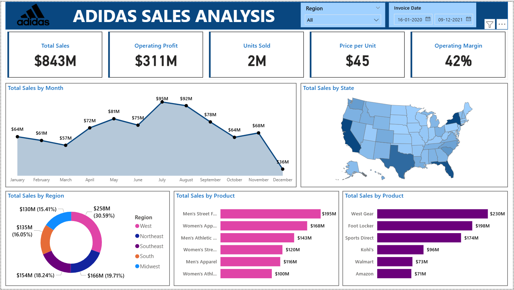

# 📊 Adidas US Sales Analysis

## 📝 Project Overview
This project provides an in-depth analysis of **Adidas' sales performance** across the United States using real-world data.  
It focuses on **total sales, operating profit, units sold, price per unit, and operating margin** while breaking down the data by **month, region, product category, and retailer**.  

The analysis was done using **Excel / Power BI**, providing a visually interactive dashboard for better decision-making.

---

## 📂 Dataset Information
The dataset used for this analysis is stored in `Adidas US Sales Datasets.xlsx` and contains the following columns:

- **Retailer** – Name of the retailer (e.g., Foot Locker, Amazon, Walmart)
- **Retailer ID** – Unique ID for each retailer
- **Invoice Date** – Date of transaction
- **Region / State / City** – Location of sales
- **Product** – Product sold (e.g., Men's Apparel, Women's Street Footwear)
- **Price per Unit** – Selling price of each unit
- **Units Sold** – Number of units sold
- **Total Sales** – Total revenue generated
- **Operating Profit** – Profit after deducting operating costs
- **Operating Margin** – Profit margin in percentage
- **Sales Method** – Type of sale (In-store or Online)

---

## 📈 Key Insights from Dashboard

### 1️⃣ **Overall Performance**
- **Total Sales:** `$843M`
- **Operating Profit:** `$311M`
- **Units Sold:** `2M`
- **Average Price per Unit:** `$45`
- **Operating Margin:** `42%`

### 2️⃣ **Sales Trend**
- Peak sales occurred in **July ($95M)** and **August ($92M)**.
- Sales dropped significantly in **December ($36M)**.

### 3️⃣ **Regional Analysis**
- **Highest Sales Region:** Midwest (`$258M`, 30.59%)
- Other regions (West, South, Southeast, Northeast) contributed steadily but less than Midwest.

### 4️⃣ **Product Analysis**
- **Top-selling Product:** Men's Street Footwear (`$195M`)
- Other major contributors:
  - Women's Apparel: `$168M`
  - Men's Athletic Footwear: `$143M`

### 5️⃣ **Retailer Performance**
- **Top Retailer:** West Gear (`$230M` sales)
- Followed by Foot Locker (`$198M`) and Sports Direct (`$174M`).

---

## 🛠 Tools & Technologies Used
- **Microsoft Excel** – Data cleaning & preparation  
- **Power BI** – Dashboard creation & visualization  
- **Python (Pandas)** – Dataset exploration & preprocessing (optional)

---

## 📊 Dashboard Preview

---

## 🎯 Business Value
This analysis helps Adidas:
- Identify **high-performing regions and retailers**
- Track **seasonal sales patterns**
- Improve **inventory management**
- Optimize **product strategy** based on top-performing categories

---

## 📌 How to Use
1. Open `Adidas US Sales Datasets.xlsx` in Excel or Power BI.
2. Connect to the dataset and refresh data if needed.
3. Use interactive slicers (Region, Date Range) to filter insights.
4. Explore visuals for monthly trends, regional performance, and product-level breakdowns.

---

## 📧 Contact
For questions or collaboration, feel free to reach out:  
📩 **badashanmukhasai@gmail.com**  
🔗 [LinkedIn – Shanmukha Sai Bada](https://www.linkedin.com/in/shanmukha-sai-bada/)

---
